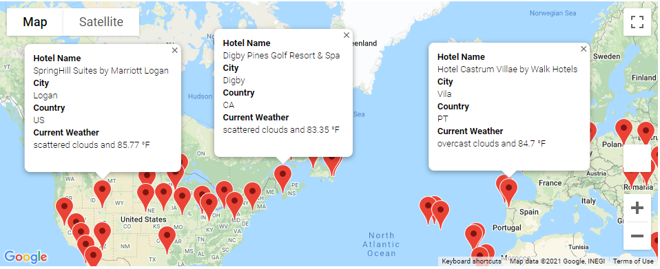

# World Weather Analysis
## Deliverable 1: Retrieve Weather Dta
Code:\
\
Weather Database CSV:\

## Deliverable 2: Create a Customer Travel Destination Map
Code:\
\
WeatherPy Vacation DataFrame:\
\
Vacation map:\
\
