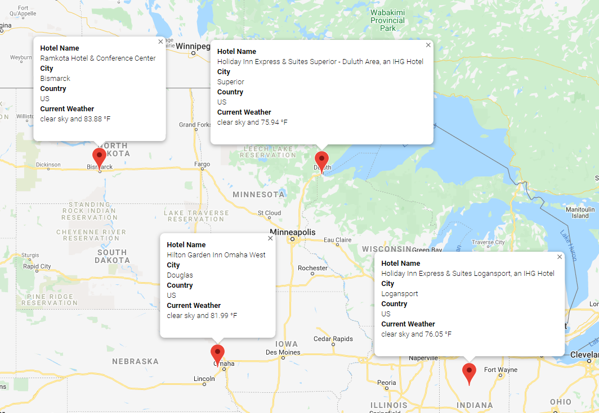

# World Weather Analysis
## Purpose

## Deliverable 1: Retrieve Weather Data
### Code:

### Weather Database CSV:

## Deliverable 2: Create a Customer Travel Destinations Map
### Code:

### WeatherPy Vacation DataFrame:

### Vacation Map:

## Delieverable 3: Create a Travel Itinerary Map
### Code:

### Travel Map:

### Travel Map with Map Markers:

